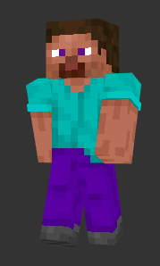

# mc-skin-api

Minecraft skin API to add accessories to skins.


## Running the API

```bash
npm run build
npm start # or PORT=<PORT> npm start, default port is 3000
```

All accessories should be placed in the `accessories/` folder.

## Using the API

Check out the following links, where `PLAYER` is the player's name:
- **Get a player's skin:** http://localhost:3000/skin/PLAYER
- **Get a list of available accessories:** http://localhost:3000/accessories (the ones starting with an underscore are for testing purposes)
- **Get a player's skin with an accessory:** http://localhost:3000/merge/?user=PLAYER&accessory=jacket
- **Get an online skin with an accessory:** http://localhost:3000/merge/?url=http%3A%2F%2Flocalhost%3A3000%2Fskin%2FPLAYER&accessory=jacket (you might want to use another link to get the skin)

The last one requires the `url` query parameter to be encoded. You can use the following javascript code to encode it:
```js
encodeURIComponent('http://localhost:3000/skin/PLAYER')
```

Or in Java:
```java
URLEncoder.encode("http://localhost:3000/skin/PLAYER", StandardCharsets.UTF_8.toString());
```

This API should work **no matter what the player's skin** is (64x32 or 64x64, slim or wide arms), as long as it's a valid skin. The accessories adapt to the skin's dimensions, see [Python scripts](./scripts/README.md) for more details.

Result, if the player has a the default Steve skin, with `/skin/PLAYER`:

<div style="display: flex; justify-content: center;">

|  |  |
| :-: | :-: |
| Default Steve skin | Steve with a jacket |

</div>

The skin is made with a first layer and an overlay. When the accessory has pixels on the first layer and the skin has pixels on the overlay, the skin pixels on the overlay will be hidden to show the accessory if `hide_overlay` is set to `true` (default behavior).

> Be careful when you use a generated skin, **make sure to choose the right dimensions on the launcher** (slim or wide arms). If you're not sure, use the `scripts/is_slim.py` script to check the skin type.

## Modifying the accessories

See the [Python scripts](./scripts/README.md) to modify the accessories or get more details on how conversions are made.

## See also

Check the following links for some accessories:
- https://www.planetminecraft.com/collection/144558/clothing-for-skins/
- https://www.planetminecraft.com/collection/183720/clothing-for-skins-2/
- https://www.planetminecraft.com/collection/185908/clothing-for-skins-3/

Accessories made by:
- Jacket: [LeafLady](https://www.planetminecraft.com/skin/pink-jacket-5876328/)
- Coat: [FFTeller](https://www.planetminecraft.com/skin/blue-coat-massivelooks-ftu/)
- Space helmet: [Ivango](https://www.planetminecraft.com/skin/space-helmet-5508206/)
- Backpack: [Heldchen](https://www.planetminecraft.com/skin/backpack-base/)
