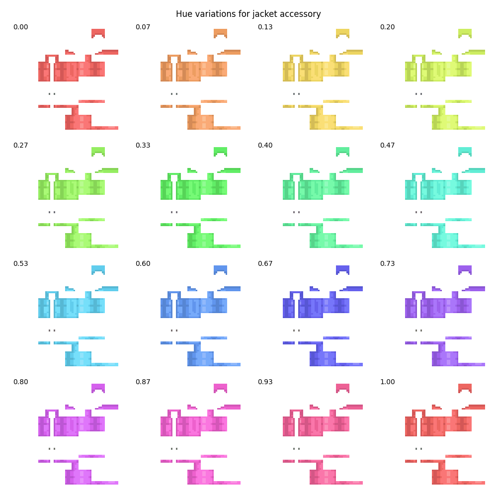
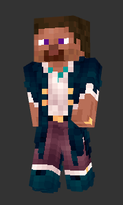
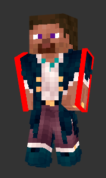
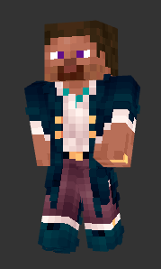

## Python scripts to modify accessories

These scripts are meant to be used once you have an accessory, and should be run in this folder. They will help making the accessory to your taste and ready to be used in the API.

Before, you can create an virtual environment and install the requirements:

```bash
python3 -m venv venv
source venv/bin/activate
pip install -r requirements.txt
```

### Changing colors

To change the color of the accessories, you can try the following to find an interesting value for the hue:

```bash
python3 hue.py accessories/jacket.png
```

This will open a matplotlib window:



Once you have found a value you like, let's say `0.60`, you can apply it to the accessory:

```bash
python3 hue.py accessories/jacket.png 0.60
```

### Widen the accessory

> **If the accessory was made for a slim skin** (i.e. with 3px arms instead of 4px) and the skin it's going to be used on is wide, the API will stretch the accessory. **This can make the accessory look weird.**

In the API and with this script, we consider the new pixel needed (to go from 3px to 4px) to be the farthest from the body (see the red pixels on the image below).

If you don't want the accessory to be stretched, you can use the `widen.py` script. It will move the pixels in the accessory, and leave red pixels for you to fill in. This allows more control over the accessory.

On the following images, accessories are placed on a default skin to better show the difference.
(1) shows the accessory on a slim skin, (2) shows the accessory after using `widen.py`, which leaves red pixels to fill in, and (3) shows the widening made by the API, which only duplicates the 3rd pixels of the accessory to the 4th.

<div style="display: flex; justify-content: center;">

|  |  |  |
| :-: | :-: | :-: |
| (1) Accessory on slim skin | (2) Accessory after using `widen.py` | (3) Widening made by the API |

</div>

To get the accessory widened, as (2), you can use the following command:

```bash
python3 widen.py accessories/coat.png
```

You will then need to fill in the red pixels, and save the image in the accessories folder.

(Note it will check whether the accessory is already wide, using `is_slim.py`)

### Editing an accessory

If you're using VSCode, you can use the [Luna Paint](https://marketplace.visualstudio.com/items?itemName=Tyriar.luna-paint) extension to edit the images.
You can also use Paint for instance, or skin editors online, making sure to select slim or wide arms depending on the accessory.
